<p align="center">
  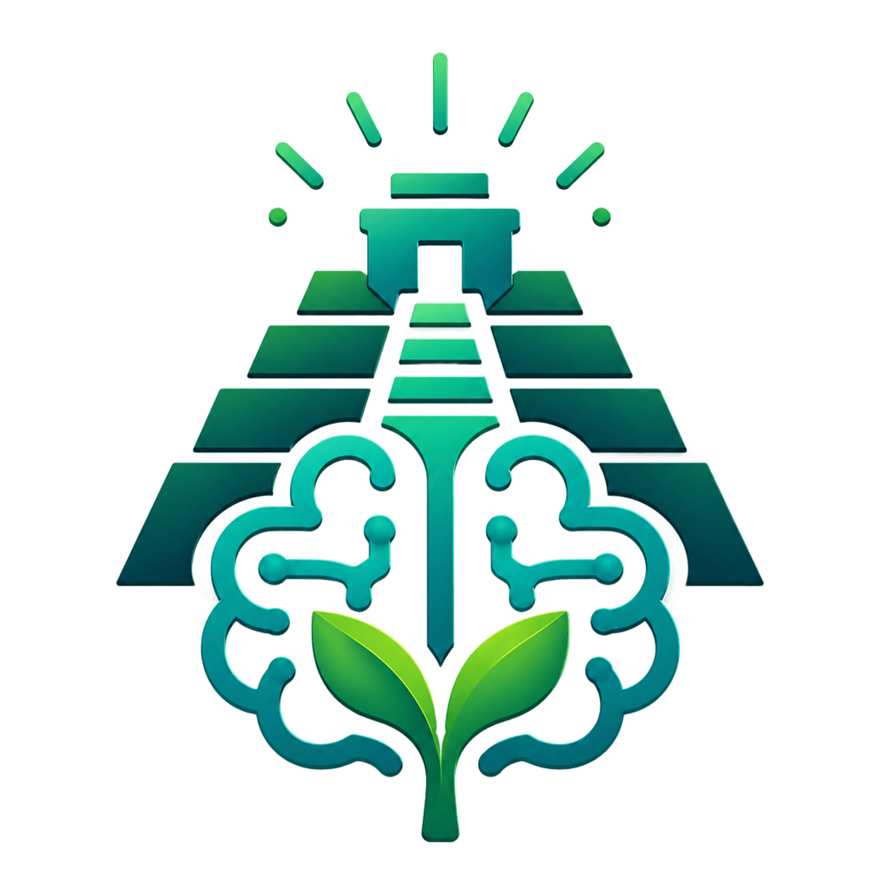
  <h1 align="center">Taan Mind</h1>
</p>

<p align="center">
  A privacy-focused AI chat interface with Paperless-ngx document management, automatic OCR processing, and a KPI dashboard — built with Nuxt 4.
</p>

<p align="center">
  Taan Mind is an AI-powered companion for <a href="https://github.com/paperless-ngx/paperless-ngx">Paperless-ngx</a> that adds automatic OCR workflows, AI metadata extraction, document-aware chat, and smart document operations using OpenAI-compatible APIs and Ollama.
</p>

<p align="center">
  
  
  
  
  
  
   <a href="https://deepwiki.com/zademy/taan-mind"></a>
</p>

---

## Features

- **AI Chat** — Streaming conversations with multiple AI providers (MiniMax, GLM) and personality presets
- **Paperless-ngx Integration** — Full document management proxy with CRUD, search, and binary download
- **Automatic OCR** — Background document processing pipeline using Ollama + MuPDF
- **AI Metadata Extraction** — Auto-suggest titles, tags, correspondents, and document types
- **KPI Dashboard** — Document statistics with interactive charts (status, timeline, MIME type, document type)
- **Document Context** — Inject Paperless document content (OCR/AI-processed) as context into chats
- **AI Tools** — Chart generation, weather forecasts, and web search sources
- **Anonymous Sessions** — No login required, HTTP-only session cookies with local SQLite storage
- **Docker Ready** — Multi-stage Dockerfile with hardened runtime and integrated Paperless-ngx stack via Docker Compose

## Tech Stack

| Technology                                           | Purpose                            |
| ---------------------------------------------------- | ---------------------------------- |
| [Nuxt 4](https://nuxt.com/)                          | Full-stack Vue 3 framework         |
| [Nuxt UI 4](https://ui.nuxt.com/)                    | Component library (Tailwind CSS 4) |
| [AI SDK](https://sdk.vercel.ai/)                     | Streaming AI integration           |
| [Drizzle ORM](https://orm.drizzle.team/)             | Type-safe SQLite ORM               |
| [NuxtHub](https://hub.nuxt.com/)                     | Database & deployment              |
| [Ollama](https://ollama.com/)                        | Local LLM for OCR                  |
| [MuPDF](https://mupdf.com/)                          | PDF/image processing               |
| [Comark](https://comark.ca/)                         | Markdown rendering                 |
| [nuxt-charts](https://github.com/nuxt-modules/chart) | Chart.js visualizations            |

## Screenshots

<p align="center">
  <a href="images/01.png">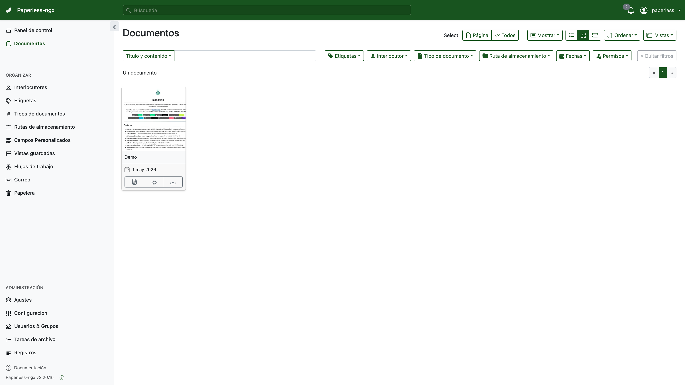</a>
  <a href="images/02.png">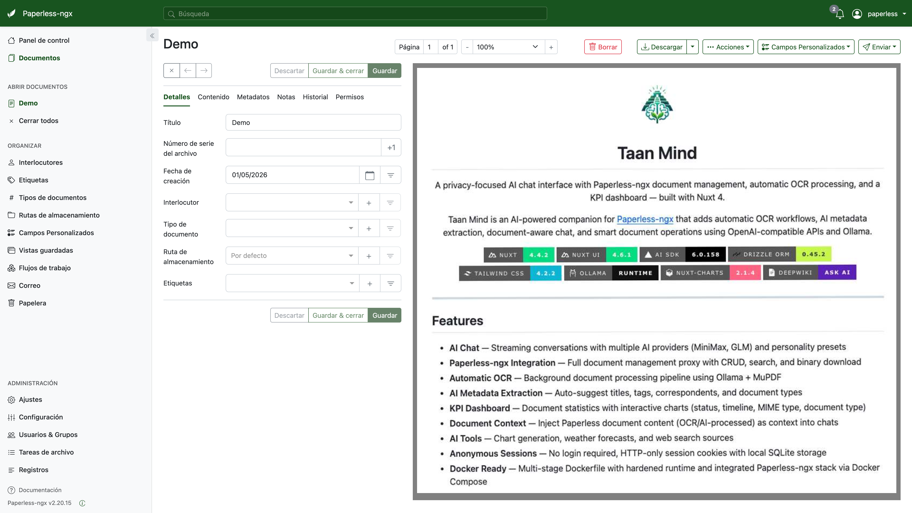</a>
  <a href="images/03.png">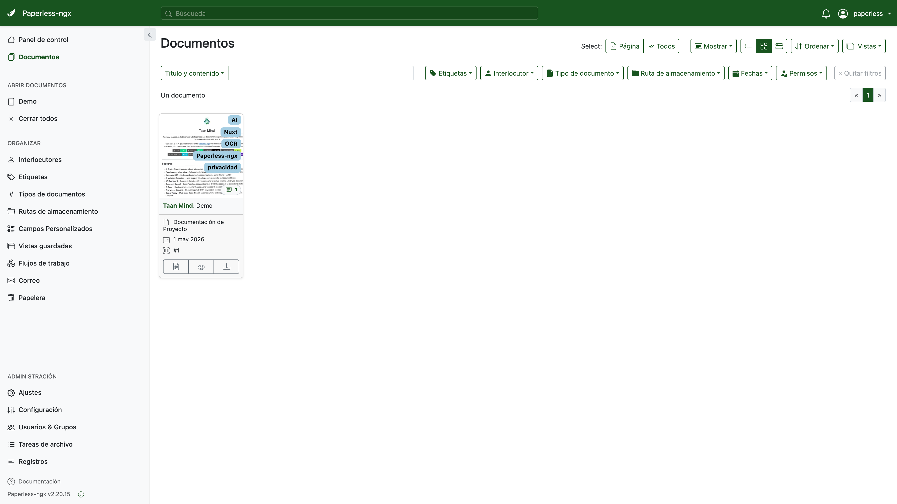</a>
</p>
<p align="center">
  <a href="images/04.png">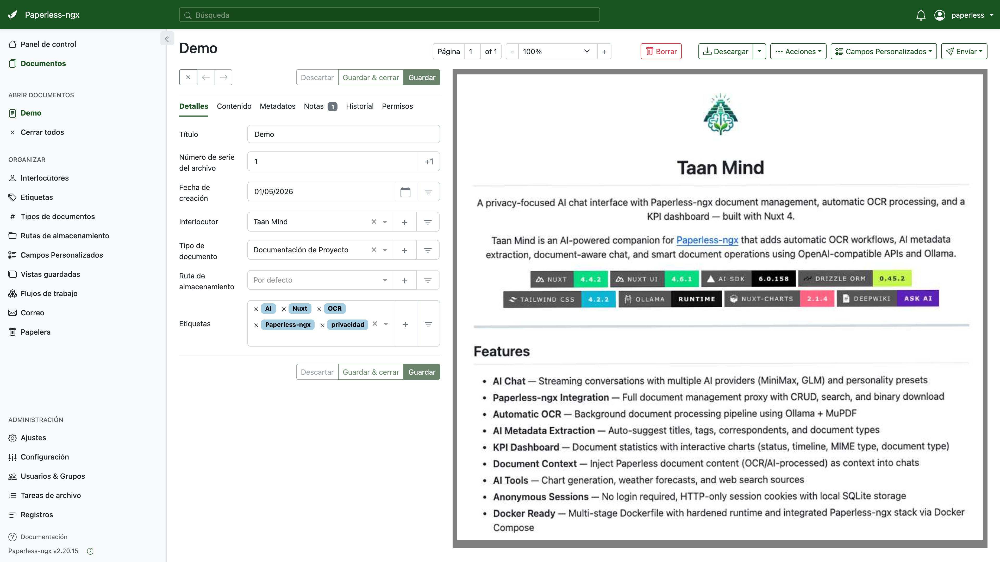</a>
  <a href="images/05.png">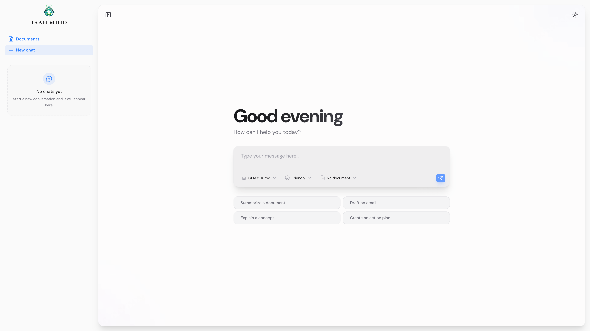</a>
  <a href="images/06.png">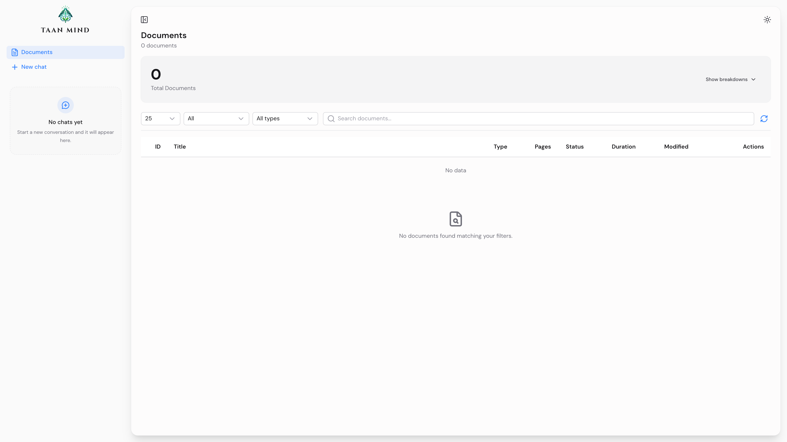</a>
</p>
<p align="center">
  <a href="images/07.png">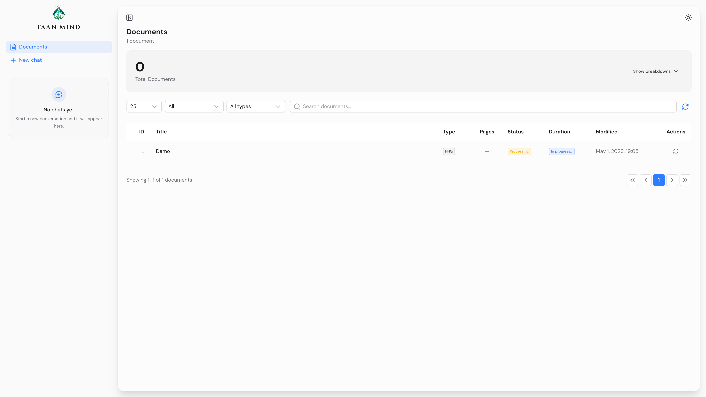</a>
  <a href="images/08.png">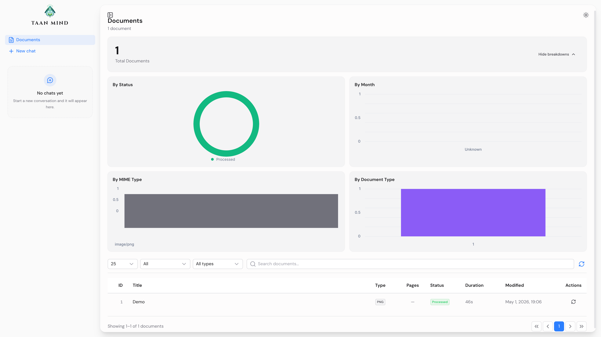</a>
  <a href="images/09.png">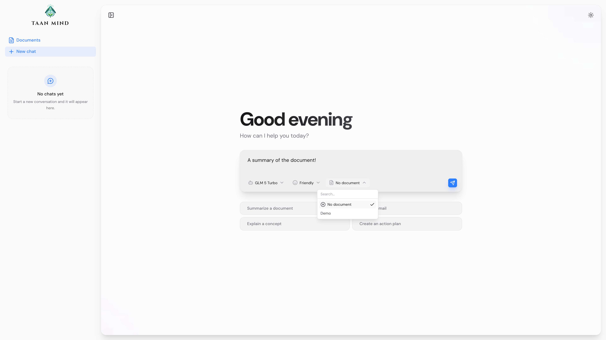</a>
</p>
<p align="center">
  <a href="images/10.png">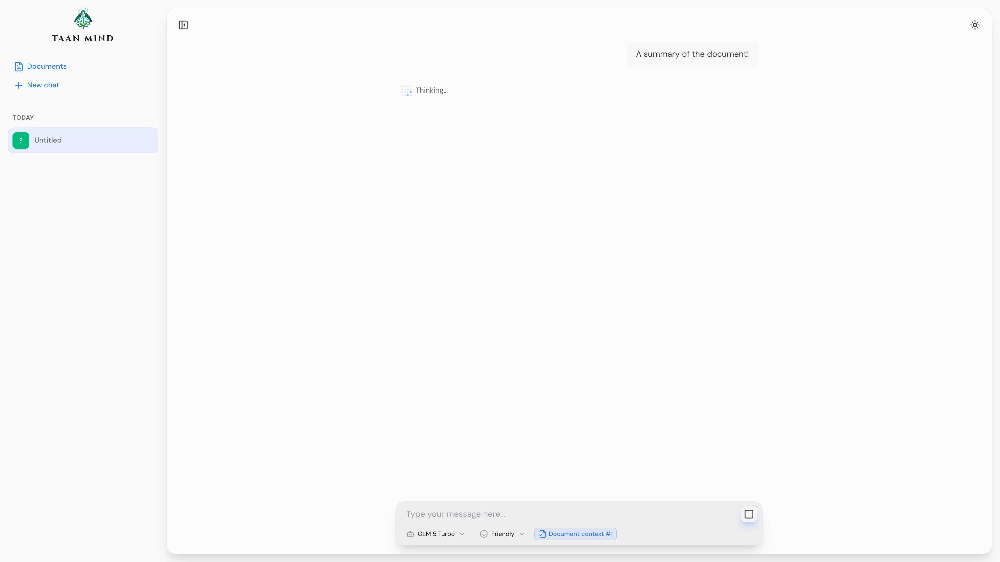</a>
  <a href="images/11.png">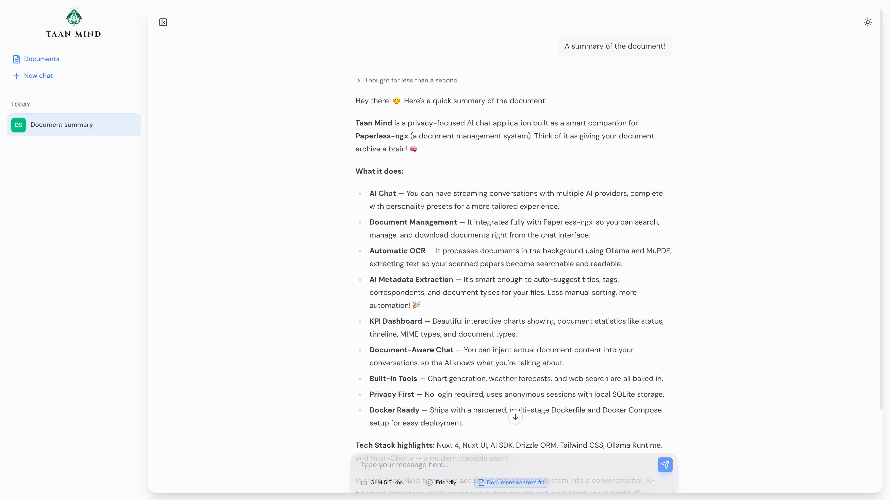</a>
</p>

## Getting Started

### Prerequisites

- Node.js 22+
- pnpm 10+

### Installation

```bash
git clone https://github.com/zademy/taan-mind.git
cd taan-mind
pnpm install
```

### Configuration

```bash
cp .env.example .env
```

Edit `.env` with your API keys (see [Environment Variables](#environment-variables)).

### Development

```bash
pnpm dev
```

Open [http://localhost:3000](http://localhost:3000).

### Docker Compose (Full Stack)

The included `docker-compose.yml` spins up the entire stack — the app, Paperless-ngx (with Redis, PostgreSQL, Gotenberg, and Tika), and a bootstrap service that creates the admin user and API token.

```bash
# Build and start everything
docker compose up -d --build

# Remove the completed bootstrap container after startup
docker compose rm -f paperless-bootstrap
```

> [!NOTE]
> Docker Compose does **not** start Ollama. See [Ollama Runtime](#ollama-runtime) for details.

The app runs on `http://localhost:3000` and Paperless-ngx on `http://localhost:8000`.

## Environment Variables

| Variable                       | Required | Description                                                       |
| ------------------------------ | -------- | ----------------------------------------------------------------- |
| `MINIMAX_API_KEY`              | Yes      | MiniMax API key                                                   |
| `MINIMAX_BASE_URL`             | No       | MiniMax API endpoint                                              |
| `GLM_API_KEY`                  | Yes      | Z.AI GLM API key                                                  |
| `GLM_BASE_URL`                 | No       | Z.AI API endpoint                                                 |
| `NUXT_PAPERLESS_BASE_URL`      | Yes      | Paperless-ngx instance URL                                        |
| `NUXT_PAPERLESS_API_TOKEN`     | Yes      | Paperless-ngx API token                                           |
| `PAPERLESS_BOOTSTRAP_USER`     | No       | Admin user created by Docker Compose (`paperless`)                |
| `PAPERLESS_BOOTSTRAP_PASSWORD` | No       | Password for the bootstrap admin user (`paperless`)               |
| `PAPERLESS_BOOTSTRAP_EMAIL`    | No       | Email for the bootstrap admin user (`paperless@example.local`)    |
| `NUXT_OLLAMA_BASE_URL`         | No       | Ollama server URL (`http://host.docker.internal:11434` in Docker) |
| `NUXT_OLLAMA_MODEL`            | No       | Ollama model for OCR (`glm-ocr:latest`)                           |
| `NUXT_SYNC_INTERVAL_MS`        | No       | Paperless sync interval in ms (`5000`)                            |
| `NUXT_PROCESS_INTERVAL_MS`     | No       | Document processing interval in ms (`10000`)                      |

## Ollama Runtime

Docker Compose does not start Ollama. Run Ollama outside this stack and point the app to it with `NUXT_OLLAMA_BASE_URL`.

This is intentional. Ollama runtime choices depend on the host operating system and hardware:

- **macOS** — Install Ollama on the host for Metal GPU acceleration
- **Linux + NVIDIA** — Use Docker GPU support (requires NVIDIA Container Toolkit)
- **Linux + AMD** — Requires ROCm and different device mappings
- **No GPU** — Run Ollama on CPU

Install Ollama for your host, then pull the OCR model:

```bash
ollama pull glm-ocr:latest
```

For Docker Compose, configure the app container to reach host Ollama:

```env
NUXT_OLLAMA_BASE_URL=http://host.docker.internal:11434
NUXT_OLLAMA_MODEL=glm-ocr:latest
```

For local development without Docker:

```env
NUXT_OLLAMA_BASE_URL=http://localhost:11434
NUXT_OLLAMA_MODEL=glm-ocr:latest
```

## Docker Compose Paperless Bootstrap

When you run the integrated Docker Compose stack, the `paperless-bootstrap` service waits for Paperless-ngx to become healthy, then creates or updates an admin user and registers the API token used by the app.

Default bootstrap identity:

```env
PAPERLESS_BOOTSTRAP_USER=paperless
PAPERLESS_BOOTSTRAP_PASSWORD=paperless
PAPERLESS_BOOTSTRAP_EMAIL=paperless@example.local
```

Token behavior:

```env
# Manual mode: use this exact token for Paperless and the app.
NUXT_PAPERLESS_API_TOKEN=your_token_here

# Automatic mode: leave it empty and let the stack derive a token deterministically.
NUXT_PAPERLESS_API_TOKEN=
```

If `NUXT_PAPERLESS_API_TOKEN` has a value, `paperless-bootstrap` registers that exact token in Paperless and the app uses the same value.

If `NUXT_PAPERLESS_API_TOKEN` is empty, the stack derives the token from the bootstrap identity and `PAPERLESS_SECRET_KEY`. The same deterministic input values must be available to both `paperless-bootstrap` and the app.

> [!TIP]
> Change the bootstrap values in `.env` before the first `docker compose up` if you want different Paperless admin credentials.

## Project Structure

```
paperless-ui-chat/
├── app/
│   ├── components/          # Vue components (chat, tools, selectors, stats)
│   ├── composables/         # Reactive logic (models, chats, paperless, OCR, stats)
│   ├── layouts/             # App layout with collapsible sidebar
│   ├── pages/               # Routes: /, /chat/[id], /documents
│   └── utils/               # Client-side helpers
├── server/
│   ├── api/                 # API routes (chats, cache, OCR, paperless proxy, KPI, health)
│   ├── db/                  # Drizzle schema + migrations (chats, messages, paperless_documents)
│   ├── plugins/             # Background sync & document processing
│   └── utils/               # Server utilities (AI models, session, OCR pipeline)
├── shared/
│   ├── types/               # Shared TypeScript types
│   └── utils/               # Models, personalities, AI tool definitions
├── .github/workflows/       # CI (lint + typecheck)
├── docker-compose.yml       # Full stack with Paperless-ngx
├── Dockerfile               # Multi-stage build with auto-migration entrypoint
└── nuxt.config.ts
```

## API Overview

| Endpoint                   | Description                                                           |
| -------------------------- | --------------------------------------------------------------------- |
| `POST /api/chats/:id`      | AI streaming chat with document context and tool support              |
| `GET /api/cache/documents` | Paginated cached documents with filters and sorting                   |
| `GET /api/kpi/documents`   | Aggregated document statistics (status, MIME type, month, type)       |
| `GET /api/health`          | Lightweight liveness check for container health                       |
| `POST /api/ocr/extract`    | Extract text from uploaded files via Ollama + MuPDF                   |
| `/api/paperless/*`         | Full Paperless-ngx CRUD proxy (documents, tags, correspondents, etc.) |

## AI Models

| Provider | Model ID               | Display Name |
| -------- | ---------------------- | ------------ |
| MiniMax  | `minimax/MiniMax-M2.7` | MiniMax M2.7 |
| GLM      | `glm/glm-5`            | GLM 5        |
| GLM      | `glm/glm-5.1`          | GLM 5.1      |
| GLM      | `glm/glm-5-turbo`      | GLM 5 Turbo  |

> [!NOTE]
> More AI model providers and model presets will be added over time as the project evolves.

## Scripts

| Script             | Purpose                          |
| ------------------ | -------------------------------- |
| `pnpm dev`         | Start development server         |
| `pnpm build`       | Build for production             |
| `pnpm preview`     | Preview production build         |
| `pnpm lint`        | Run ESLint                       |
| `pnpm typecheck`   | Run Vue TypeScript type checking |
| `pnpm db:generate` | Generate Drizzle migrations      |
| `pnpm db:migrate`  | Run database migrations          |

## License

This project is licensed under the [MIT License](LICENSE).

## Support Development

If Tata-Mind is useful to you, consider buying me a coffee!

<a href="https://ko-fi.com/C0C01Y1SQI" target="_blank"></a> <a href="https://buy.stripe.com/00wcN67J46kl8LY8GYfMA01" target="_blank"></a>
