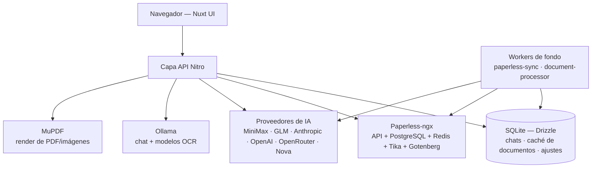

# Vista general de arquitectura

Taan Mind es una aplicación full-stack **Nuxt 4** (Vue 3, TypeScript) con rutas de servidor **Nitro**, organizada en tres superficies. La interfaz nació del [Nuxt UI Chat Template](https://github.com/nuxt-ui-templates/chat) y evolucionó a compañero de Paperless-ngx.

## Capas

| Capa | Ruta | Contenido |
| --- | --- | --- |
| Cliente | `app/` | `pages/`, `components/` agrupados por feature, `composables/` (incluido el grupo de dominio `usePaperless/`), `layouts/`, `middleware/` (`auth.global.ts`), `utils/` |
| Servidor | `server/` | `api/` con rutas agrupadas por dominio (chats, paperless, ocr, kpi, cache, personalities, projects, settings, usage, devices…), `utils/` auto-importados, `db/`, `plugins/` (workers de fondo) y `middleware/auth.ts` |
| Compartida | `shared/` | `types/`, `utils/` y `constants/` usados por ambos lados |

## Runtime

- El cliente Nuxt llama a rutas Nitro; el chat usa el registro de modelos compartido (`shared/utils/models.ts`) y puede invocar proveedores externos u Ollama.
- El proxy Paperless mantiene las operaciones de Paperless detrás de la API de la app; el [worker de sincronización](../flows/sincronizacion-paperless.md) importa metadatos a la base local.
- El [procesador de documentos](../flows/procesamiento-de-documentos.md) lee documentos cacheados, ejecuta OCR, enriquece con el modelo de IA seleccionado y actualiza metadatos faltantes en Paperless.
- SQLite almacena datos propios de la app: chats autenticados, contenido cacheado de documentos, estado de procesamiento y ajustes. Paperless conserva sus propios metadatos, cola de tareas y ficheros.

## Convenciones del código

- Las rutas de API siguen el nombrado de Nitro: `documents.get.ts`, `chats.post.ts`, `[id].patch.ts`, `[id].delete.ts`; los parámetros llegan por `event.context.params`.
- Los helpers de servidor viven en `server/utils/` (auto-importados por Nitro); los tipos que cruzan fronteras, en `shared/types/`.
- Validación de entrada con **Zod**, imitando las formas de respuesta de los handlers vecinos del mismo dominio.
- Componentes auto-importados en PascalCase; composables con prefijo `use`. Se prefieren componentes Nuxt UI e iconos lucide.
- **Nuxt UI 4 + Tailwind CSS 4** con configuración CSS-first en `app/assets/css/main.css`; no existe archivo `tailwind.config`.

## Decisiones relacionadas

- [Proveedores de IA](./decision-proveedores-ia.md)
- [SQLite + Drizzle](./decision-sqlite-drizzle.md)
- [Workers de fondo](./decision-workers-fondo.md)
- [Autenticación](./decision-autenticacion.md)

## Fuentes

- [AGENTS.md](../../AGENTS.md)
- [README.md](../../README.md)
