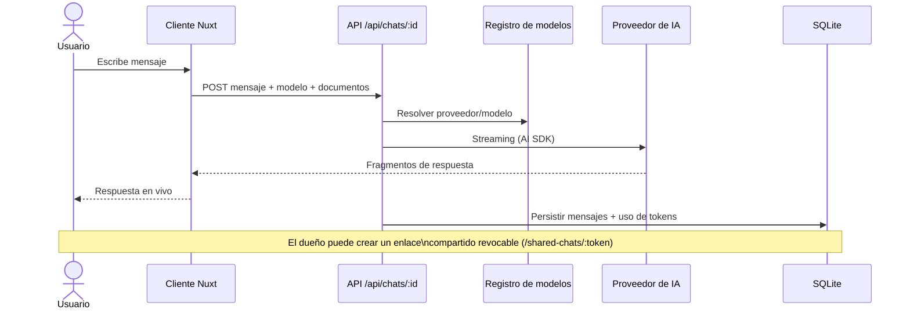

# Chat con streaming

Flujo de una conversación: el cliente envía un mensaje, la API de chats consulta el registro de modelos, hace streaming contra el proveedor seleccionado, persiste la conversación y permite compartirla con un enlace de solo lectura.

## Pasos

1. **Envío** — el usuario escribe en la página de chat (`app/pages/chat/`); el composable de chats hace `POST /api/chats/:id` con el mensaje, el modelo elegido y la personalidad.
2. **Contexto documental** — si hay documentos seleccionados, su contenido procesado (OCR/IA) se inyecta como contexto.
3. **Resolución de modelo** — la API usa el registro compartido (`shared/utils/models.ts`) para resolver proveedor y modelo; puede ser estático o descubierto de Ollama/OpenRouter.
4. **Streaming** — la respuesta llega por streaming (Vercel AI SDK); las herramientas de IA (gráficos, clima, búsqueda web) pueden intervenir durante la generación.
5. **Persistencia** — mensajes y metadatos se guardan en SQLite; el consumo de tokens se registra en `usage`.
6. **Compartir** — el dueño crea un enlace de solo lectura (`/api/chats/:id/share`): token opaco, revocable y rotativo; la vista pública `GET /api/shared-chats/:token` muestra la transcripción mínima sin barra lateral.

## Diagrama

## Relacionado

- [Proveedores de IA](../concepts/proveedores-ia.md)
- [Decisión: proveedores de IA](../architecture/decision-proveedores-ia.md)
- [Módulo chat](../modules/modulo-chat.md)

## Fuentes

- [README.md](../../README.md)
- [AGENTS.md](../../AGENTS.md)
