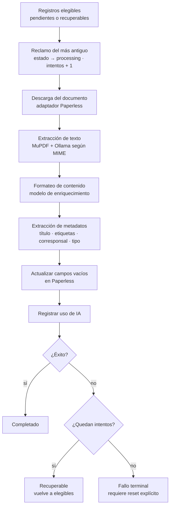

# Procesamiento de documentos

Pipeline de **OCR y enriquecimiento en segundo plano**: convierte documentos crudos de Paperless en texto limpio más metadatos sugeridos por IA, y devuelve a Paperless los campos que faltan. Lo orquesta el plugin `server/plugins/document-processor.ts` sobre el módulo `documentProcessingRun` (`server/utils/documentProcessingRun.ts`).

## Pasos

1. **Reclamo** — el scheduler reclama como máximo un registro elegible: el más antiguo en estado pendiente o recuperable pasa a `processing` e incrementa su contador de intentos.
2. **Descarga** — el run descarga el documento original desde Paperless mediante el adaptador.
3. **Extracción de texto** — el pipeline OCR, consciente del MIME, combina parsers directos, conversión de imágenes, render de PDF (**MuPDF**) y **OCR con Ollama** según el tipo de documento.
4. **Formateo de contenido** — el texto se limpia y formatea con el modelo de enriquecimiento (ajuste global de la app).
5. **Extracción de metadatos** — la IA sugiere título, etiquetas, corresponsales y tipo de documento.
6. **Actualización de Paperless** — se rellenan solo los campos vacíos de Paperless; la taxonomía se busca o crea, y se asigna ASN si corresponde.
7. **Registro de uso** — el consumo de IA del run queda registrado en el dominio `usage`.
8. **Transición de estado** — el registro local pasa a completado o, si falla, vuelve a recuperable; al agotar el límite de intentos queda en **fallo terminal** y no se vuelve a seleccionar sin reset explícito.

## Diagrama

## Puntos de atención

- El worker llama a las APIs internas mediante `internalApiAuth`; **conservar esa vía** al modificarlo.
- El scheduler no posee OCR, enriquecimiento, mutación de Paperless ni política de estado: solo temporiza, reclama y delega.

## Relacionado

- [Registro de documento](../concepts/registro-de-documento.md) — vocabulario del dominio.
- [Sincronización con Paperless](./sincronizacion-paperless.md) — cómo llegan los registros al caché.
- [Módulo procesamiento](../modules/modulo-procesamiento.md) — superficie de código.

## Fuentes

- [CONTEXT.md](../../CONTEXT.md)
- [AGENTS.md](../../AGENTS.md)
- [README.md](../../README.md)
