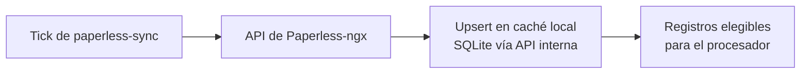

El plugin `server/plugins/paperless-sync.ts` ejecuta una **importación periódica** de los metadatos de documentos de Paperless-ngx hacia el caché local de la app (SQLite), creando o actualizando los registros de procesamiento que luego consume el [procesador de documentos](./procesamiento-de-documentos.md).

## Pasos

1. **Tick del worker** — el plugin se dispara en segundo plano con su cadencia configurada; no corre en sesión de usuario.
2. **Lectura del catálogo** — consulta la API de Paperless (documentos y taxonomías) a través del adaptador.
3. **Upsert local** — cada documento de Paperless se refleja como registro en el caché: se crean los nuevos y se actualizan los metadatos de los existentes, preservando el estado de procesamiento y el contenido ya enriquecido.
4. **Elegibilidad** — los registros nuevos o pendientes quedan disponibles para que el scheduler del procesador los reclame.

## Diagrama

## Puntos de atención

- El worker llama a las APIs internas mediante `internalApiAuth`: **conservar esa vía** al tocarlo.
- Paperless es la fuente de verdad documental; el caché local es espejo de trabajo para búsqueda, KPIs y enriquecimiento.

## Relacionado

- [Integración Paperless-ngx](../concepts/integracion-paperless.md) — el concepto de dominio.
- [Workers de fondo](../architecture/decision-workers-fondo.md) — la decisión de arquitectura.
- [Módulo paperless](../modules/modulo-paperless.md)

## Fuentes

- [AGENTS.md](../../AGENTS.md)
- [README.md](../../README.md)
